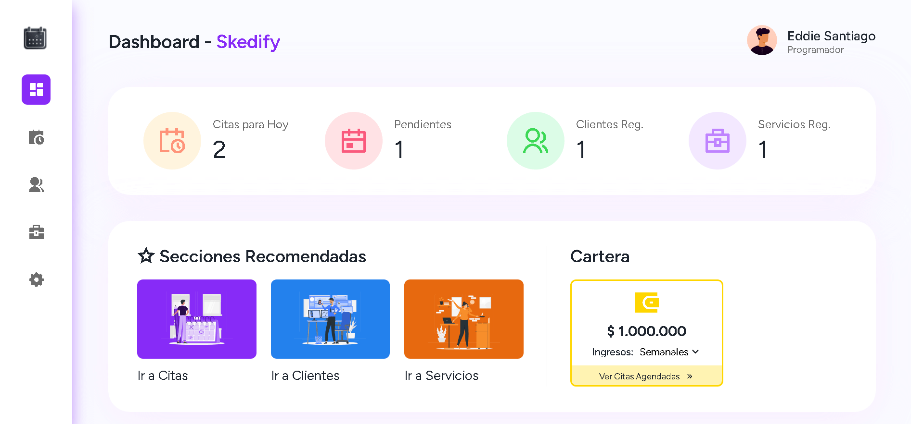
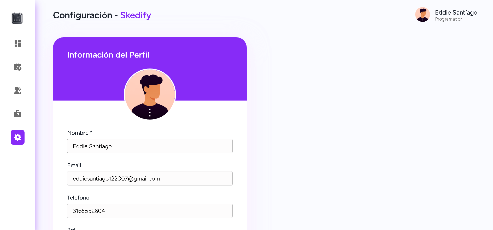
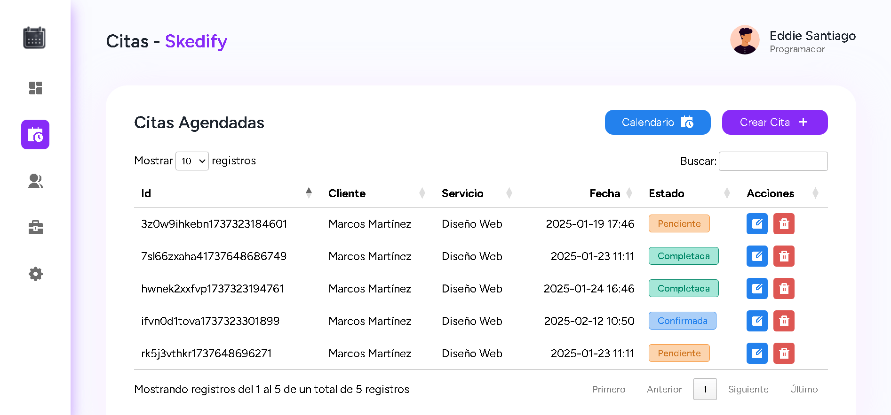
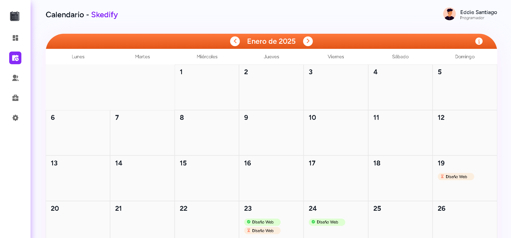

# Skedify - App de Gestión de Citas

Skedify es una aplicación web diseñada para empresas que necesitan gestionar citas de manera eficiente. La aplicación permite registrar clientes, servicios y citas, y organiza visualmente las citas en un calendario interactivo. El sistema utiliza IndexedDB como base de datos para almacenar la información de manera local en el navegador del usuario, ofreciendo una experiencia rápida y eficiente.

Con el objetivo de optimizar la gestión de citas, mejorar la planificación diaria y ofrecer una experiencia profesional a los usuarios, esta herramienta combina una interfaz intuitiva, funcionalidad avanzada y tecnologías modernas. Es una solución ideal para pequeñas y medianas empresas que buscan simplificar y modernizar su organización.

## Demo

[Demo](https://skedify.vercel.app/)

## Capturas de Pantalla

## Funcionalidades

- **Registro de clientes y servicios:**: Administra fácilmente toda la información relevante de tus clientes y los servicios que ofreces.
- **Gestión de citas:** Crea, edita y organiza tus citas en un calendario interactivo y fácil de usar.
- **Interactividad avanzada:** Utiliza funcionalidades como arrastrar y soltar (drag and drop) para modificar las citas directamente desde el calendario (disponible en dispositivos de escritorio).
- **Reportes generales:** Desde el panel de control, genera estadísticas detalladas sobre ingresos obtenidos, citas pendientes, clientes registrados, servicios ofrecidos y otros indicadores clave
- **Almacenamiento local:** Gracias al uso de IndexedDB y LocalStorage, toda la información se almacena de forma segura en el navegador.
- **Interfaz intuitiva:** Diseñada para ser fácil de usar y minimizar el tiempo requerido para la gestión de citas.

## Documentación

[Documentación](https://www.notion.so/Descripci-n-del-Proyecto-16b009b2d10681438ae5e62b894bf42f?pvs=4)

## Tecnologías Empleadas

**Frontend:** HTML, CSS, Javascript\
**Librerias/Complementos**: Indexed DB, Datatables, SweetAlert, Notyf

## Proyectos Relacionados

[Taskie: App de Gestión de Tareas](https://github.com/eddiedev14/Taskie)

[PokeDexius](https://github.com/eddiedev14/PokeDexius)